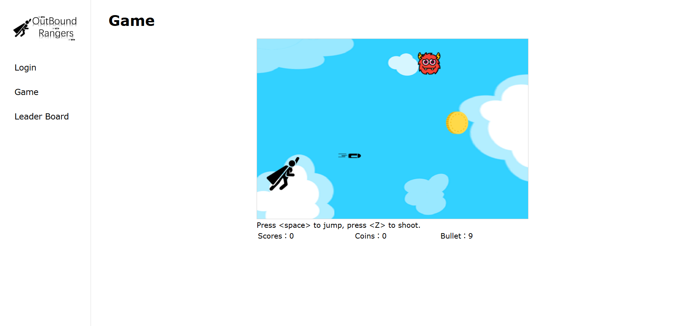

# Outbound Rangers

This repository contains a clone of the group project ([original repo](https://github.com/CSCI3100-Project-GroupF4/csci3100-project)) developed for the CUHK course CSCI3100: Software Engineering (Spring 2021).

## Overview

This project is a game site with a 2D shooting game.

Users can create their account and log in to access more features, such as tracking high scores, earning in-game coins and purchasing in-game items.

### Tools and Frameworks Used

- Vue CLI
- Node.js
- Express.js
- MongoDB

## Image Sources

- [いらすとや](https://www.irasutoya.com/)

- [Flaticon](https://www.flaticon.com/)
